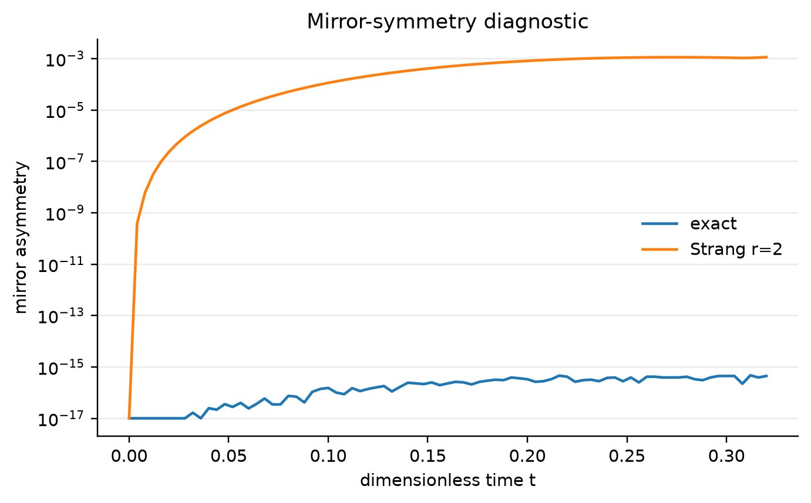

# SU2ZX research results

Generated: 2026-09-04T18:22:52.418350+00:00  
Commit: `10bef335342f9eb5f685896de19dd16504acc0f3`

## Run status

| Layer | Status | Evidence |
|---|---|---|
| CPU physics and six-basis reconstruction | PASS | `artifacts/data/physics_summary.json` |
| Generic target compiler resource gate | PASS | `artifacts/data/compiler_dataset.csv` |
| Learned selector | NULL | `artifacts/data/selector_summary.json` |
| CUDA-Q `qpp-cpu` | LOCAL CPU PASS | `artifacts/data/accelerator_status.json` |
| CUDA-Q GPU | BLOCKED - UNSUPPORTED GPU ARCHITECTURE | `artifacts/data/accelerator_status.json` |
| Tensor-network GPU routes | BLOCKED - UNSUPPORTED GPU ARCHITECTURE | `artifacts/data/accelerator_status.json` |
| Direct cuTensorNet | BLOCKED - UNSUPPORTED GPU ARCHITECTURE | `artifacts/data/accelerator_status.json` |
| IBM QPU | NOT RUN - AUTHORIZATION/CREDENTIALS REQUIRED | `artifacts/qpu/` |

`EXECUTED - REVIEW NUMERICAL AGREEMENT` is not automatically a validation pass. It means the optional program ran and its value must still be compared with the CPU reference.

## Research question

Can a backend-aware selector over exactly equivalent Qiskit/PyZX pipelines reduce native two-qubit resources and, when authorized hardware data exist, lower physics-level distribution error for a five-plaquette SU(2) real-time circuit family?

The preregistered resource hypothesis requires median native two-qubit-count reduction of at least 15% and native two-qubit-depth reduction of at least 10%. The AI hypothesis requires grouped-CV regret below every fixed strategy. The hardware hypothesis requires a negative selected-minus-Qiskit paired TVD difference for both raw and M3-projected data; it cannot be evaluated without authorized real-device data.

## Model and conventions

- Gauge group: SU(2), pure gauge.
- Truncation: `j_max = 1/2`.
- Geometry: five spatial plaquettes in a one-plaquette-wide open chain, a tiny 2+1D Hamiltonian geometry.
- Coupling: `x = 2.0` in `H_tilde = 2H/g^2`, `x=2/g^4` units.
- Initial Qiskit-order state: `|q4 q3 q2 q1 q0> = |00100>`.
- Primary product formula: second-order Strang with `r=2`.
- Exact-Hamiltonian and ideal-Trotter references are stored separately.

This is a compiler and hardware-validation model. It is not continuum SU(2), SU(3) QCD, or a quantum-advantage demonstration.

## Environment and provenance

- Execution target: Omarchy/Arch Linux, kernel `7.1.9-arch1-2`, Python 3.11.
- CPU/RAM probe: 12 logical CPUs and 16,429,694,976 bytes of RAM.
- GPU: `NVIDIA GeForce GTX 1060 with Max-Q Design`, 6144 MiB VRAM, driver `580.178.04`, compute capability `6.1`.
- CUDA-Q version: `0.15.1`. Current GPU minimum: compute capability 7.5 ([official compatibility source](https://nvidia.github.io/cuda-quantum/latest/using/install/local_installation.html)).
- The repository scope lock prevented reading `/etc/os-release`; Omarchy is the user-supplied execution environment. `nvcc` was unavailable.
- Full package pins are preserved in `artifacts/environment-pip-freeze.txt`; commands and test/compiler output are in `artifacts/logs/`.

## Correctness gates

| Gate | Tolerance | Result |
|---|---:|---|
| One-plaquette matrix, spectrum, ground state, transition formula | `1e-12` or tighter | PASS |
| Two-plaquette matrix and `-1.789221846776` ground energy | `1e-12` | PASS |
| Hermiticity and exact/Trotter normalization for `N=1,2,5` | `1e-12` | PASS |
| Qiskit little-endian strings/bitstrings | exact assertion | PASS |
| Manual Pauli rotation versus matrix exponential | exact unitary equivalence | PASS |
| Strang convergence for `r=1,2,4,8` | strictly decreasing infidelity | PASS |
| Exact five-plaquette mirror symmetry | `1e-12` | PASS |
| Six-basis versus direct energy | `<1e-10` | PASS (`1.257e-13`) |
| Probability-simplex projection | nonnegative, sum within `1e-13` | PASS |
| PyZX Basic/teleport/full-reduce at `N=2,5` | exact unitary equivalence | PASS |
| IBM dry-run manifest and fresh-token guard | 60 unique physics circuits | PASS |

The final local test command was `.mamba/envs/su2zx/bin/python -m pytest -q`: 13 tests passed. Ruff and mypy also passed; see `artifacts/logs/pytest.log`, `artifacts/logs/ruff.log`, and `artifacts/logs/mypy.log`.

## Observables

| Observable | Definition or estimator | Measurement/meaning |
|---|---|---|
| Computational distribution | `p(s)=|<s|psi>|^2` | Z basis; primary information for TVD |
| Loop occupation | `n_p=(1-Z_p)/2` | Retained `j=1/2` plaquette sector, not quark number |
| Survival | `L(t)=p(00100)` | Persistence of the initial central excitation |
| Electric energy | coefficient-weighted I/Z/ZZ expectations | Electric-flux contribution |
| Magnetic energy | coefficient-weighted one-X expectations | Coherent plaquette-loop mixing |
| Total energy | `E_E+E_B` | Conserved for exact H; finite-r drift diagnoses Trotter error |
| Trotter TVD | half the L1 distance to exact-H distribution | Separates product-formula error |
| Mirror asymmetry | `(abs(n0-n4)+abs(n1-n3))/2` | Symmetry/layout/noise diagnostic |

Six settings, `Z,X0,X1,X2,X3,X4`, reconstruct the entire five-plaquette Hamiltonian because every magnetic term contains exactly one X.

## Exact results at the proposed hardware times

| t | L | E_E | E_B | E | TVD | n0 | n1 | n2 | n3 | n4 |
|---:|---:|---:|---:|---:|---:|---:|---:|---:|---:|---:|
| 0 | 1 | 3 | 3.88578e-16 | 3 | 0 | 2.63156e-31 | 2.66274e-31 | 1 | 2.82739e-31 | 2.4871e-31 |
| 0.08 | 0.69581 | 3.38685 | -0.38685 | 3 | 0 | 0.0978191 | 0.0266497 | 0.903603 | 0.0266497 | 0.0978191 |
| 0.16 | 0.222567 | 4.50149 | -1.50149 | 3 | 0 | 0.339466 | 0.112381 | 0.674981 | 0.112381 | 0.339466 |
| 0.24 | 0.0287502 | 5.88127 | -2.88127 | 3 | 0 | 0.595165 | 0.243738 | 0.433808 | 0.243738 | 0.595165 |
| 0.32 | 0.00258519 | 6.63316 | -3.63316 | 3 | 0 | 0.733194 | 0.369347 | 0.264623 | 0.369347 | 0.733194 |

## Primary ideal Trotter results

| t | L | E_E | E_B | E | TVD | n0 | n1 | n2 | n3 | n4 |
|---:|---:|---:|---:|---:|---:|---:|---:|---:|---:|---:|
| 0 | 1 | 3 | 5.10926e-16 | 3 | 9.32587e-15 | 3.50596e-35 | 6.23477e-34 | 1 | 2.3834e-34 | 2.38558e-34 |
| 0.08 | 0.695665 | 3.38735 | -0.387631 | 2.99972 | 0.000207422 | 0.0978496 | 0.0267672 | 0.903631 | 0.0266666 | 0.0978526 |
| 0.16 | 0.221422 | 4.50736 | -1.47932 | 3.02804 | 0.00321733 | 0.339722 | 0.113835 | 0.674976 | 0.112945 | 0.339822 |
| 0.24 | 0.0272322 | 5.9079 | -2.68171 | 3.22619 | 0.0124777 | 0.596818 | 0.249175 | 0.431618 | 0.247371 | 0.597158 |
| 0.32 | 0.00158459 | 6.72305 | -3.14776 | 3.57529 | 0.0425684 | 0.743637 | 0.381336 | 0.25395 | 0.379175 | 0.743498 |

The CPU gate is based on an initial energy of `3`, maximum norm error `1.203e-13`, and maximum six-basis energy-reconstruction error `1.257e-13`.

## Physics plots

### Loop occupations


Solid curves are dense exact-Hamiltonian evolution; dashed curves are the primary ideal Strang circuit. Motion away from the central plaquette shows mixing among retained gauge-invariant loop sectors. Differences between paired curves are Trotter error, not hardware noise.


### Survival probability


The curve tracks the probability of measuring the initial `00100` state. Comparing repetitions exposes product-formula convergence. It is a real-time loop-sector diagnostic, not a hadron survival probability.


### Electric, magnetic, and total energy


Exact evolution conserves total energy while exchanging weight between electric and magnetic terms. The finite-r circuit can drift relative to the original Hamiltonian because it exactly conserves neither noncommuting component. This separates algorithmic error from later device error.


### Trotter TVD convergence


TVD compares each ideal product-formula computational distribution with exact-Hamiltonian evolution. Decreasing error with increasing r validates the expected second-order trend. Real hardware must instead use the exact ideal Trotter distribution as its primary reference.


### Mirror-symmetry diagnostic



The exact Hamiltonian and central initial state are reflection symmetric, so the exact curve remains at floating-point scale. The ordered finite-r Pauli product formula can introduce a small algorithmic asymmetry even without device noise; this is part of Trotter error. A real-device comparison must subtract that ideal-circuit baseline before attributing additional asymmetry to layout or noise.


## Compiler and selector

The compiler dataset uses a generic five-node linear ECR target, not an IBM device. It contains `240` strategy records. Median Basic-versus-Qiskit native two-qubit reduction is `20.3%`; median two-qubit-depth reduction is `23.5%`. Resource status is `PASS`.

All candidate records carry exact-equivalence validation: `True`. The aggressive full-reduce negative control has a median native two-qubit penalty of `68.6%` relative to Qiskit after routing, demonstrating that logical ZX simplification can create topology-hostile interactions. Native durations, routing overhead, SWAP counts, compilation times, counts, and depths are retained per row; median durations by strategy are `{"basic": 4.391981399999991e-05, "full_reduce": 9.174238799999988e-05, "qiskit": 5.959123799999985e-05, "teleport": 5.3503553999999886e-05}` seconds on the generic target model, not measured hardware wall time.

Selector top-1 accuracy is `1` and learned normalized regret is `0`. AI status is `NULL`. A null status means a fixed policy tied or beat the learned model and no AI advantage should be claimed.

### Cost-weight sensitivity

| Depth weight | Calibration-error weight | Top-1 | Learned regret | Best fixed regret |
|---:|---:|---:|---:|---:|
| 0 | 20 | 1 | 0 | 0 |
| 0.02 | 0 | 1 | 0 | 0 |
| 0.02 | 20 | 1 | 0 | 0 |
| 0.1 | 50 | 1 | 0 | 0 |

The learned selector ties always-Basic at zero regret in every tested weighting, so the result remains **NULL**, despite perfect top-1 prediction.

### Native compiler resources


This plot compares strategies only after target-aware translation and routing. Native two-qubit gates and depth are more relevant than the logical gate count because they dominate much of the hardware error budget.


### Logical versus routed cost


Points above a favorable logical trend expose extraction-induced nonlocality. Aggressive full reduction can lower logical count while raising routed native cost, which is why the selector must see topology and target information.


### Selector regret


The learned policy is compared with always-Qiskit, fixed PyZX strategies, and the oracle. A useful selector must beat every fixed baseline on grouped `(x,r)` holdouts; row-wise random splitting is prohibited.


## CUDA-Q and tensor networks

CUDA-Q `qpp-cpu` status: **LOCAL CPU PASS**. CUDA-Q GPU status: **BLOCKED - UNSUPPORTED GPU ARCHITECTURE**. Direct cuTensorNet status: **BLOCKED - UNSUPPORTED GPU ARCHITECTURE**. The `qpp-cpu` cross-checks at `N=1,2,5` have maximum energy error `1.061e-13` and maximum distribution TVD `1.029e-15` versus the shared Qiskit Strang circuit. GPU and tensor-network routes were not launched because compute capability 6.1 is below the documented 7.5 minimum. Package installation or target listing is not counted as GPU execution. MPS convergence therefore cannot be evaluated and no tensor-network plot is fabricated.

### Tensor-network convergence

Status: not generated. Check the relevant phase log.


## IBM hardware

Status: **NOT RUN - AUTHORIZATION/CREDENTIALS REQUIRED**.

If this says `NOT RUN`, no real-device conclusion is available. The guarded program must first print the backend, physical path, 60 physics circuits, eight balanced M3 calibration circuits, shots, and total usage estimate. Simulator or fake-backend output must never be relabeled as hardware data.

No IBM credential or `ALLOW_IBM_QPU_SUBMISSION=1` variable was present in the scoped environment. Reading account files outside the repository was prohibited, so backend discovery and dry-run compilation were not attempted. No job was submitted and no simulator result is represented as QPU data.

Hardware paired summary, when present: `not available`.

### Hardware TVD comparison

Status: not generated. Check the relevant phase log.


### Hardware survival and energy

Status: not generated. Check the relevant phase log.


### Raw versus M3-projected results

Status: not generated. Check the relevant phase log.


When hardware exists, the primary metric is time-averaged TVD to the exact ideal Trotter circuit. Comparison to exact Hamiltonian evolution is reported separately because it includes Trotter error. M3 quasiprobabilities are used directly for linear expectations; M3 TVD is calculated only after explicit probability-simplex projection.

## Relation to lattice QCD

The project shares gauge links, Gauss constraints, electric terms, magnetic plaquettes, Wilson-loop motivation, regulator questions, and real-time challenges with lattice QCD. It differs in gauge group (SU(2) versus SU(3)), absence of dynamical quarks, dimension, volume, and severe representation truncation.

No string tension is extracted: that requires several separations, volumes, cutoffs, lattice spacings, and controlled long-time/static-charge energies. No string breaking is present because the model has no dynamical matter. Hadronization additionally requires energetic colored initial states and gauge-invariant hadronic yields or correlations.

## Reproduction

```bash
bash scripts/bootstrap_env.sh
bash scripts/run_all.sh
```

Raw numerical outputs are in `artifacts/data/`; figures are in `artifacts/figures/`; logs are in `artifacts/logs/`. See `artifacts/environment.md` and `artifacts/environment-pip-freeze.txt` for provenance.

## Success-gate summary

| Hypothesis/gate | Outcome | Evidence |
|---|---|---|
| Mandatory CPU physics | PASS | `artifacts/logs/pytest.log`, `artifacts/data/physics_summary.json` |
| Compiler-resource threshold | PASS | `artifacts/data/compiler_dataset.csv` |
| AI selector beats every fixed policy | NULL | `artifacts/data/selector_summary.json` |
| CUDA-Q CPU agreement | LOCAL CPU PASS | `artifacts/data/accelerator_status.json` |
| CUDA-Q/cuTensorNet GPU | BLOCKED | GTX 1060 Max-Q capability 6.1 is below 7.5 |
| Hardware-physics hypothesis | NOT RUN | authorization/credentials absent; `artifacts/qpu/` has no result |
| Public repository | PLANNED - LOCAL VALIDATION COMPLETE | [genesis-su2-zx-observables](https://github.com/digonto10602/genesis-su2-zx-observables) |

## Limitations

The target is generic rather than a calibration snapshot from a named IBM backend; the compiler result does not imply improved hardware fidelity. The family is tiny, fixed at five plaquettes for selection, and the synthetic target seed is fixed. No uncertainty bars are available for exact statevector quantities. GPU tensor-network scaling and real-QPU mitigation are blocked/not run, so neither hardware performance nor large-system convergence can be inferred.

## Next 90 days

Extend to several chain lengths and calibration snapshots, repeat authorized QPU comparisons in independent windows, add static charges and flux-tube observables, and only then introduce dynamical matter in a gauge-invariant loop-string-hadron encoding. Retain exact rewrite checks and classical/tensor-network references at every stage.
