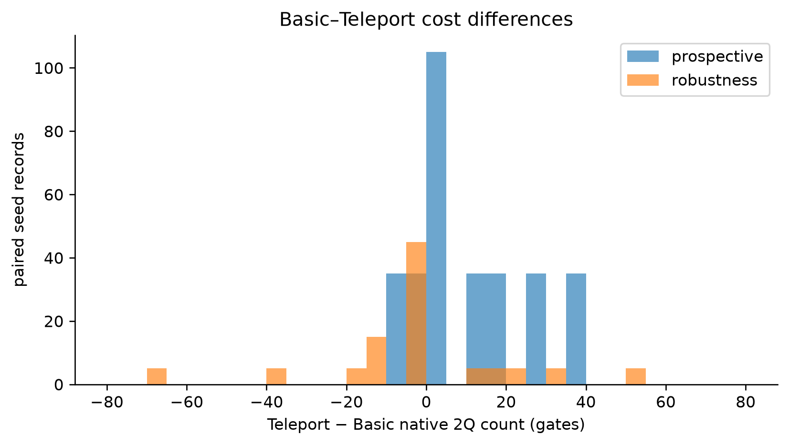
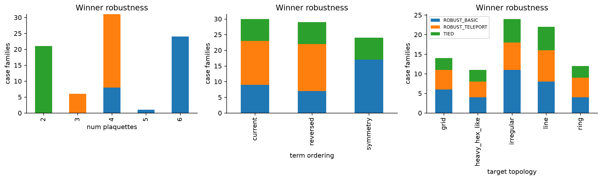
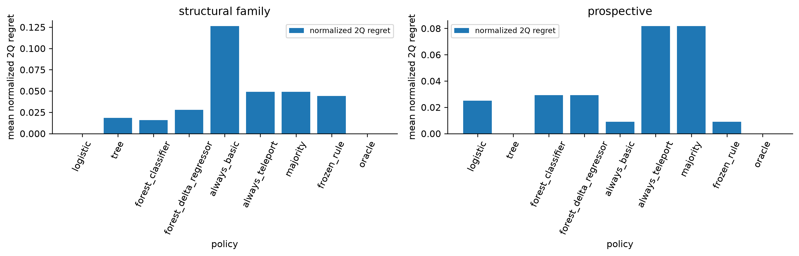
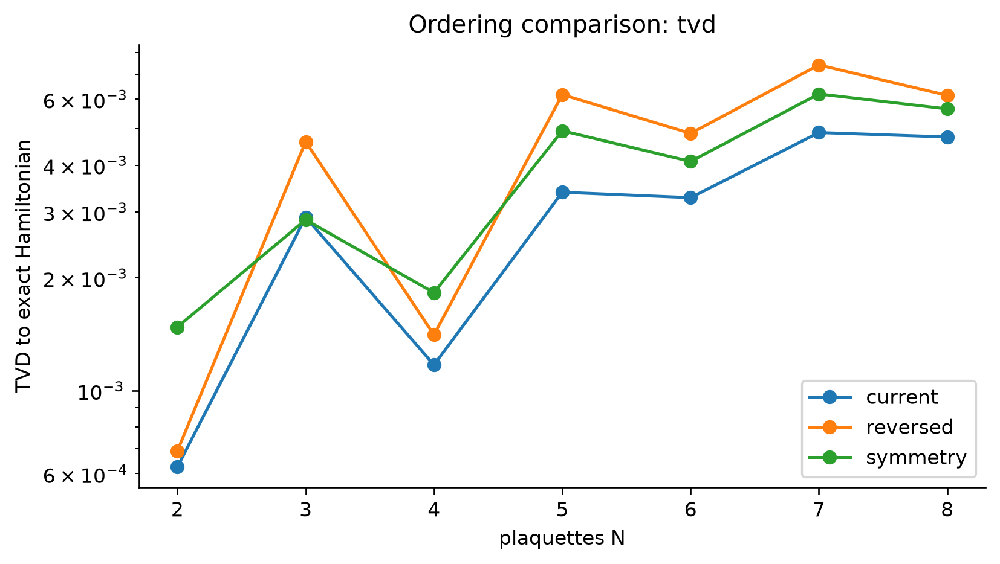
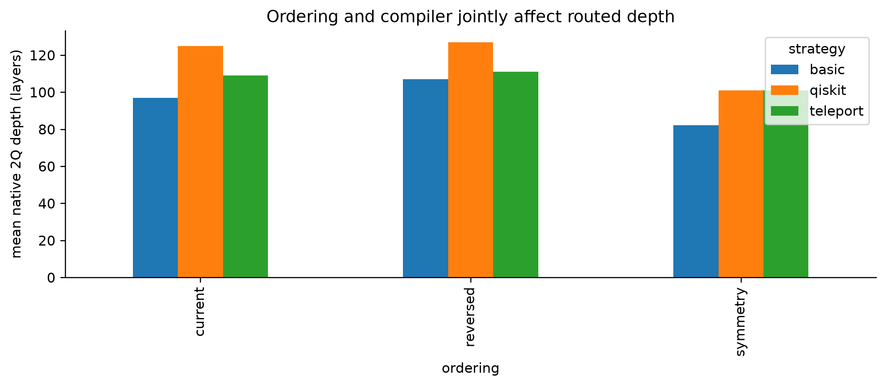
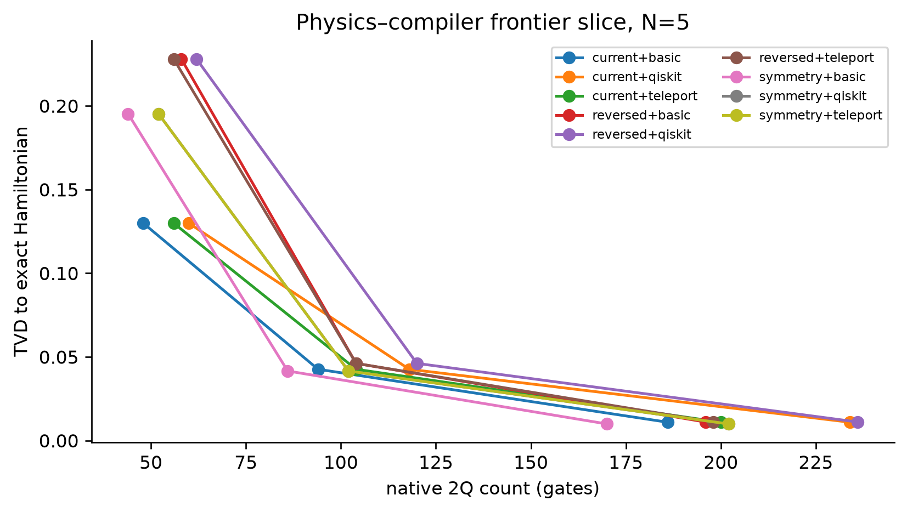

# SU2ZX research results — v0.4.0

Completion verification on 2026-09-06 reproduced all 26 tests, pairwise analysis,
18 compiler controls, direct-MPS sweep through N=32 and 16 figure pairs. Scientific
conclusions below are unchanged. The original full compiler/symmetry experiments
were audited from their saved records. See [completion audit](docs/V040_COMPLETION_AUDIT.md)
and [complete methods and test guide](docs/CODE_LOGIC_AND_TESTS.md).

Generated 2026-09-05T07:01:09.932665+00:00. Input commit `dc0e3c9eed846e34d17099249fb7cbc406499e1c`.

## Executive summary

Direct-observable CPU MPS scaling is demonstrated through **N=32**, without saving or reconstructing a full statevector on the scaling path. N=5,8 validation against ideal Trotter observables has maximum error **2.272e-09** at bond cap 64 and truncation threshold 1e-14. This is short-time, shallow-circuit scaling, not validation of large-N exact dynamics.

Basic–Teleport winner diversity survives five fixed-target routing seeds in this bounded design: **33 ROBUST_BASIC, 29 ROBUST_TELEPORT, 21 TIED** parameterized circuit/target/layout families, with zero seed-sensitive families. Of 860 attempted compiler outputs, **830 pass** the explicit numerical gates; **30 fail** and are excluded as complete pairs. The valid pairwise dataset contains **415 records**.

The pairwise ML result is **NULL**. The grouped-selected logistic model has prospective mean normalized 2Q regret **0.024954**, versus **0.008966** for the strongest simple baseline. A different depth-three tree happens to achieve zero prospective regret, but it was not the grouped-selected model; this is an exploratory result requiring a new holdout, not a validated ML advantage.

Symmetry ordering is **MIXED**: it preserves mirror symmetry and reduces source depth throughout the grid, but TVD improves in only 16 of 56 comparisons and worsens in 40. Lower energy drift does not imply uniformly better probability distributions.

## Model and claims

The source of truth remains `src/su2zx/core.py`. Its Hamiltonian and ordering definitions are unchanged. This is a gauge-reduced, j_max=1/2 pure-SU(2) plaquette chain in a severely truncated 2+1D Hamiltonian geometry. Strings use q_(N-1)...q_0. No continuum SU(2), physical SU(3) QCD, string tension, string breaking, hadronization, or quantum advantage is established. All new results are ideal CPU simulation or synthetic-target compilation, never QPU data.

## v0.3.0 baseline reproduction

The initial baseline passed 17 tests, Ruff and mypy. A fresh baseline physics execution generated 405 observable rows; all 35 historical source hashes and the 426-row dataset structure reproduce. CUDA-Q qpp-cpu is rerun at N=1,2,5 and agrees within 1e-8. All six compiler strategies remain supported and pass 18 fresh bounded control evaluations (N=2,3,5).

The prior physics conclusions remain valid in their sampled scope. The historical assertion that all compiled outputs were verified at 1e-10 was too strong: the old flag used default-tolerance logical `Operator.equiv`, without independently checking routed outputs. v0.4.0 adds that missing check. PyZX's default QASM denominator cap also introduced accumulated rounding error around 1e-10; QASM import now temporarily uses a 2**40 denominator cap and restores the library setting. Logical unitary validation explicitly uses atol=rtol=1e-10.

A separate Qiskit level-2/3 resynthesis discrepancy of about 7.18e-8 is reproducible for N=2, x=0.5, t=0.08, r=2. Level 0/1 passes the same strict check. All 30 rejected outputs belong to this small-angle family across three target cases and five seeds. Their records remain in `compiler_raw_results.csv`. Compiler comparisons retain level 2 and exclude failures; hardware preparation uses level 1 and verifies the result.

## Robust compiler-selection study

The design selects all historical strict six-strategy winners plus tied/routing anchors (23 old cases), then adds 63 prospective cases: N=2,4,6; r=3; x=1.5; t=0.20; current/reversed/symmetry ordering; seven topology/layout configurations. Seeds are 11,19,29,37,47. Synthetic target calibration seed is always 7, rather than varying with the routing seed. ECR is the only native entangler studied. Five seeds, five existing topology classes and bounded controls replace a more expensive ten-seed/full-basis/full-control Cartesian study.

Robust means at least 80% strict 2Q wins across all five seeds and a matching median delta sign. A fully tied family has five count ties. Fractions, entropy and mean/median count/depth differences are saved. Parameterized family counts are not counts of statistically independent experiments; structural angle aggregation is saved separately in `compiler_structural_results.csv` and `compiler_strict_winners.csv`.

There are zero observed strict-sign reversals across the matched layout or topology comparisons; **layout/topology robustness remains INCONCLUSIVE** outside these cases. Many comparisons are singletons, and fixed target calibration plus one basis cannot establish general hardware robustness. Prospective families have 28 robust Basic, 14 robust Teleport and 21 ties; the valid historical subset has 5 Basic and 15 Teleport families.

## Pairwise Basic-vs-Teleport analysis

Delta C = Teleport native 2Q count − Basic native 2Q count. Negative means Teleport, positive Basic, zero a count tie. Both depth and estimated duration differences are also stored. `lexicographic_label` explicitly compares (count, depth, duration), without a weighted surrogate. ML predicts the primary 2Q objective; its normalized regret is (selected count − minimum count)/max(minimum count,1), so equal-count alternatives have zero primary regret even if depths differ. Count ties are a separate classifier class and execute Basic. Exact-label accuracy and cost-oracle equality are therefore different metrics.

## ML result: NULL

Four frozen lightweight models use only source-circuit, generation, topology and pre-selection layout features. Hashes are grouping keys, never predictors. Automatic-layout distance is an explicitly labeled identity-placement proxy, not an observed routed layout. Standardization is fit on training folds only. Structural GroupKFold and leave-one-size/topology/ordering-out use **historical robustness cases only**. Seed replicas of a structural family remain together. The prospective r=3 structural families are excluded from grouped model selection and are evaluated separately. Split assignments, predictions, features and feature importances are saved.

Historical grouped regret for the selected model is 0.000000, versus 0.044138 for the strongest simple policy. This does not generalize prospectively. Logistic is the only tested learned model with zero historical grouped regret. Model settings were frozen before generation; there is no hyperparameter search or nested model selection. This small, historical-winner-enriched training set limits generalization.

## Frozen-rule prospective test

The rule was frozen in `config/research_v040.json` before new data: Teleport for N<=3 with current ordering, Basic otherwise. `frozen_design.json` records its timestamp and configuration SHA-256. It was never tuned on this holdout. On this particular holdout it matches always-Basic in cost: its differing small-N choices are count ties. Thus it does **not establish an improvement**, although it incurs low regret.

| Policy | Mean regret | Median | Worst | Oracle match |
|---|---:|---:|---:|---:|
| logistic | 0.024954 | 0.000000 | 0.269841 | 0.9048 |
| tree | 0.000000 | 0.000000 | 0.000000 | 1.0000 |
| forest_classifier | 0.029237 | 0.000000 | 0.269841 | 0.8889 |
| forest_delta_regressor | 0.029237 | 0.000000 | 0.269841 | 0.8889 |
| always_basic | 0.008966 | 0.000000 | 0.061224 | 0.7778 |
| always_teleport | 0.081875 | 0.000000 | 0.295082 | 0.5556 |
| majority | 0.081875 | 0.000000 | 0.295082 | 0.5556 |
| frozen_rule | 0.008966 | 0.000000 | 0.061224 | 0.7778 |
| oracle | 0.000000 | 0.000000 | 0.000000 | 1.0000 |

## Symmetry-aware Trotterization

The physics grid has N=2..8, r=1,2,4,8, (x,t)=(1,0.16),(2,0.32), and three orders: 168 rows. Odd N uses the central occupied plaquette; even N uses the two central occupied plaquettes, making the initial state reflection invariant. Exact evolution uses sparse `expm_multiply` of the shared Hamiltonian. Occupations, survival, electric/magnetic/total energy, norm, TVD and mirror asymmetry are saved.

| Metric vs current ordering | Better | Worse | Equal within 1e-12 |
|---|---:|---:|---:|
| tvd | 16 | 40 | 0 |
| energy_drift | 44 | 12 | 0 |
| mirror_asymmetry | 48 | 0 | 8 |
| source_depth | 56 | 0 | 0 |

Maximum symmetry-ordering mirror asymmetry is 1.11e-15. Symmetry compiler comparison covers N=3,5,7; r=1,2,4; x=2,t=0.32; Qiskit/Basic/Teleport; fixed favorable synthetic line and seed 11 (81 passing outputs). Count comparisons (lower/higher/equal): `{'lower': 20, 'higher': 4, 'equal': 3}`. Depth comparisons: `{'lower': 21, 'higher': 3, 'equal': 3}`. These are matched ordering comparisons, not a device performance claim.

## Trotter convergence

N=5,x=2,t=0.32 representative TVD fits follow epsilon(r) proportional to r^(-p). Full uses r=1,2,4,8; asymptotic uses r=2,4,8. The expected second-order Strang limit is p=2. All size/parameter/order fits and slope standard errors are saved; coarse and asymptotic fits are distinct.

| Ordering | Fit | Exponent p | Slope standard error |
|---|---|---:|---:|
| current | full | 1.865777 | 0.064949 |
| current | asymptotic | 1.978062 | 0.008880 |
| reversed | full | 2.120832 | 0.048109 |
| reversed | asymptotic | 2.038107 | 0.012924 |
| symmetry | full | 2.102885 | 0.034696 |
| symmetry | asymptotic | 2.043896 | 0.014824 |

## Joint physics/compiler frontier

`physics_compiler_frontier.csv` marks nondominated choices within each N/x/time group over TVD, mirror asymmetry, native 2Q count, native 2Q depth and estimated duration. Repetition and ordering/strategy choices compete; mirror residuals below 1e-10 are treated as numerical ties. No arbitrary combined score is used. Duration is a synthetic-target estimate in seconds. The plot is a 2D projection of this five-metric comparison.

## Tensor network

**VALIDATED direct-observable MPS; SCALING_DEMONSTRATED without statevector reconstruction.** Aer saves Z_i, X_i, neighboring ZZ correlators, electric/magnetic/total energies, normalized identity expectation, and compact MPS tensors. Occupations are (1-Z_i)/2. [Aer save_expectation_value](https://qiskit.github.io/qiskit-aer/stubs/qiskit_aer.library.save_expectation_value.html) and [MPS snapshot APIs](https://qiskit.github.io/qiskit-aer/tutorials/7_matrix_product_state_method.html) were checked against installed signatures before implementation.

N=5,8 have independent ideal-Trotter and exact-Hamiltonian observable references. Caps 8/32/64 use thresholds 1e-10/1e-14/1e-14. N=12,16,20,24,32 scaling saves no statevectors; tests forbid statevector-save calls in the direct path. At N=32, cap 64 reaches final bond 10 with 72,112 returned tensor bytes and about 0.18 s runtime on this run. Cap 32 and 64 observables agree numerically throughout scaling. This short-time circuit has low final entanglement; longer-time growth is untested. Normalized identity is not a discarded-weight bound. Tensor bytes are final compact-state storage; cumulative process RSS includes imports and earlier runs and is not per-case peak workspace.

## CUDA-Q and IBM

CUDA-Q CPU **PASS** at N=1,2,5. GPU **BLOCKED_BY_HARDWARE**: the detected GTX 1060 Max-Q is compute capability 6.1. No unsupported GPU execution or driver modification occurred. Existing target-selectable CUDA-Q scripts remain available for a supported future device; no GPU tensor-network scaling is claimed.

IBM metadata **NOT_AVAILABLE** under repository-only credential scope. QPU **NOT_RUN**, zero submitted jobs. A 120-circuit synthetic hardware-ready bundle compares current/symmetry × Basic/Teleport, five times and six measurement bases. The analysis accepts all variants and retains exact Hamiltonian → ideal Trotter → compiled ideal → raw/mitigated hardware hierarchy. The live `--comparison` workflow recompiles against the chosen real backend. Submission requires the environment guard, `--submit`, and a matching one-use dry-run token bound to the manifest/configuration and expiring after 15 minutes. No token is archived.

## Validation and limitations

Tests: 26 passed, 47 warnings in 6.57s. Ruff, formatting, mypy and data-integrity checks pass. Routed equivalence compares the zero state plus three seeded random complex states, including initial/final layout and ancilla leakage, at 1e-10. It is a numerical randomized check, not an exhaustive routed-unitary proof. [Qiskit layout documentation](https://quantum.cloud.ibm.com/docs/en/api/qiskit/qiskit.transpiler.TranspileLayout) describes the two permutations handled explicitly.

All targets are synthetic, with a fixed calibration seed and one native basis. Compiler grids are bounded and historical selection is winner-enriched. No seed sensitivity was observed; this cannot prove absence on harder routing problems. Physics compiler anchors use one layout/seed. Large-N TN lacks an exact-Hamiltonian reference. ML is NULL; symmetry is MIXED. Validation excludes failed outputs without silently relaxing tolerance.

## Next research milestone

Freeze the successful exploratory shallow-tree decision boundary and test a new long-depth holdout on independent calibrated targets and adverse layouts, while extending direct MPS to longer times and monitoring bond/truncation growth. This would distinguish real structure/target dependence from the simple N/order boundaries in this bounded study.

## Artifacts and completion

Machine-readable data: `artifacts/data/v040/`; 16 PNG/PDF figures and source mapping: `artifacts/figures/v040/`. Provenance: `artifacts/provenance/run_v0.4.0.json`. Graphify and exact final archive receipts are recorded in `GRAPHIFY_UPDATE.md`, `RUN_MANIFEST.md`, and the timestamp-matched files under `zip_results/`.
