# SU2ZX research results — v0.3.0

Generated: 2026-09-04T22:11:55.476510+00:00<br>
Input Git commit: `fdf631acfeb351dd400ef79c3b63235a1758eeb1`

## Executive summary

This run preserves the validated gauge-reduced SU(2), `j_max=1/2` plaquette-chain physics and turns the compiler benchmark into a non-degenerate target-aware problem. All 426 compiler records passed global-phase-aware exact unitary equivalence. Across 70 distinct structural-circuit/target cases, Basic won 54 lexicographic cases and teleport won 16; the stricter native-2Q-only audit found 3 Basic and 15 teleport wins. The winner-diversity gate therefore **PASS**.

The ML selector result is **NULL**. Its structural-family-holdout mean regret is 0.0694, versus 0.0356 for always-Basic and 0.1854 for always-Qiskit. It improves on Qiskit but not the strongest fixed baseline, so no ML advantage is claimed.

The symmetry-aware Strang ordering is positive for the sampled five-plaquette trajectory: maximum TVD changes from 0.0425684 to 0.0415574, maximum energy drift from 0.57529 to 0.241868, and maximum mirror asymmetry from 0.00115 to 3.33067e-16, with unchanged source 2Q count.

CPU MPS validation is **PASS** for N=5,8 at maximum bond dimension 32; N=12 is exploratory. CUDA-Q CPU remains **LOCAL CPU PASS**. CUDA-Q GPU remains **BLOCKED_BY_HARDWARE** on the compute-capability-6.1 GTX 1060 Max-Q. IBM QPU is **NOT_RUN**; no job was submitted.

## Physics model and boundaries

`src/su2zx/core.py` remains the sole Hamiltonian and convention source. The model is a pure SU(2), `j_max=1/2`, one-plaquette-wide open spatial chain in a truncated 2+1D Hamiltonian geometry. Qiskit strings and displayed bitstrings use `q_(N-1)...q_0`. This study does not establish continuum SU(2), physical SU(3) QCD, string tension, string breaking, hadronization, or quantum advantage.

The reference hierarchy is exact Hamiltonian → ideal Strang circuit → compiled ideal circuit → noisy/hardware result. No simulator or MPS output is labeled as QPU data.

## Validation

- Current local test result: `17 passed, 2 warnings in 5.42s`.
- One- and two-plaquette analytic matrices and spectra, Hermiticity, normalization, Qiskit ordering, Pauli rotations, energy reconstruction, reflection symmetry, PyZX equivalence, and guarded IBM dry-run behavior are covered by `tests/`.
- Maximum state-norm error: `1.203e-13`.
- Maximum six-basis energy-reconstruction error: `1.257e-13`.
- Compiler equivalence: `426/426` verified at recorded tolerance `1e-10`.
- Seed sensitivity: `54/54` verified; maximum native-2Q seed span was `8` gates, confined to stochastic aggressive-reduction cases.

## Trotter analysis

The fit uses ordinary least squares of `log(max TVD)` on `log(r)` for `r=1,2,4,8`. It gives `p = 1.866 ± 0.065` (slope standard error), approaching the expected second-order value. The procedure and points are stored in `artifacts/data/trotter_convergence.csv` and `physics_summary.json`.

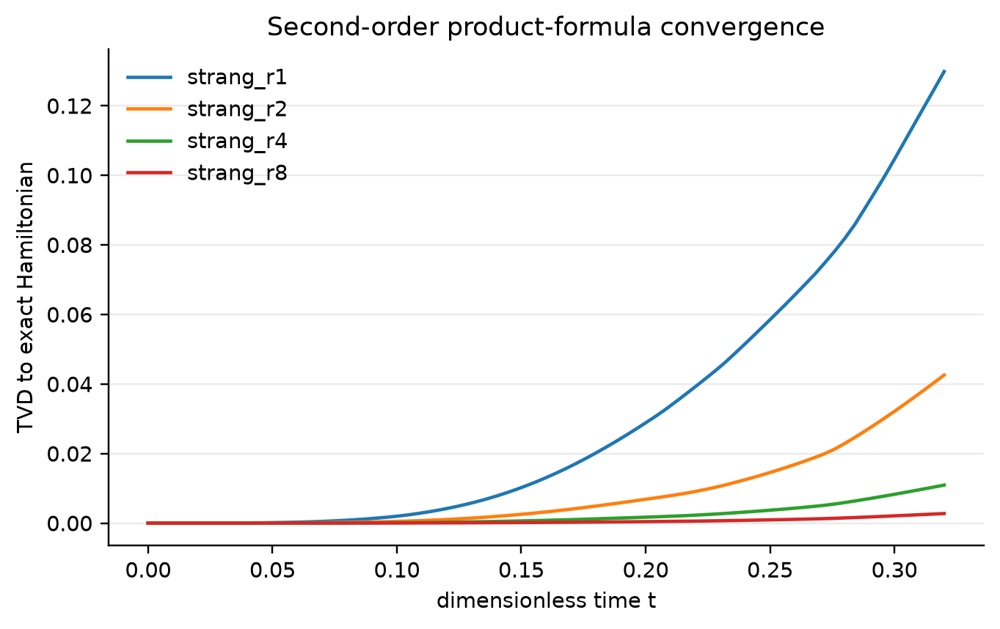

Exact-vs-Strang TVD across time and repetition counts.

## Physics observables

Stored observables include local plaquette occupation, central-state survival, electric, magnetic and total energy, norm, TVD, and mirror asymmetry. They are loop-sector diagnostics of the truncated model, not quark or hadron observables.

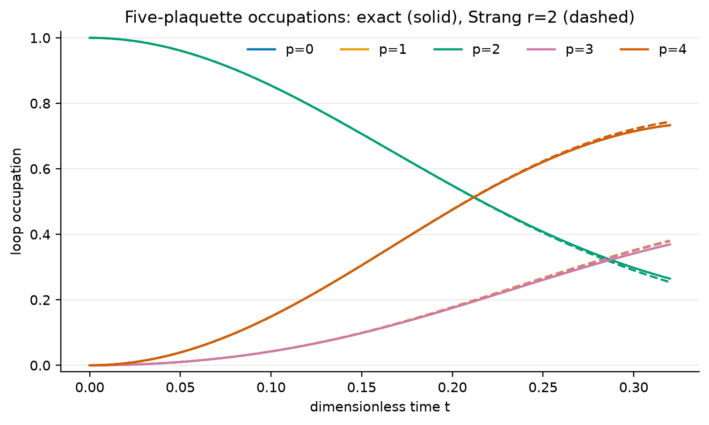

Plaquette occupations for exact and ideal-Trotter evolution.

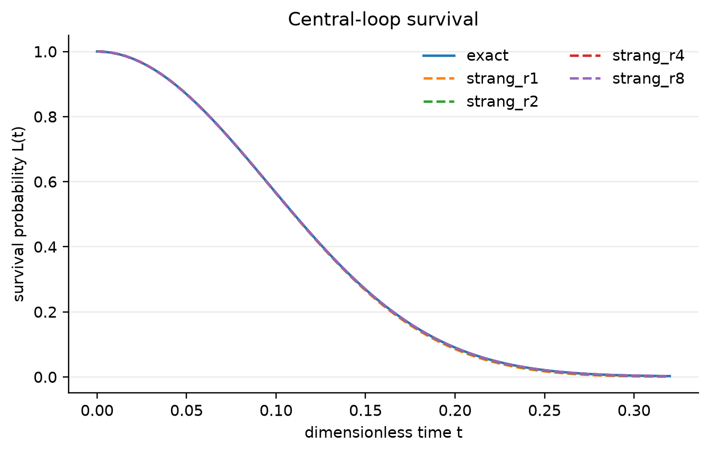

Central-state survival probability.

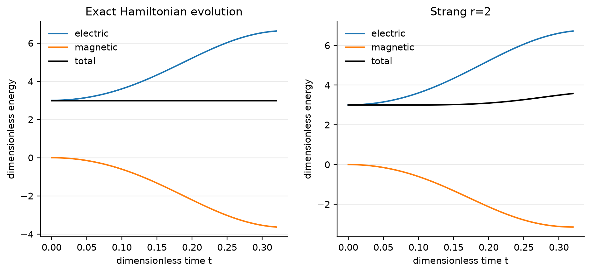

Electric, magnetic, and total energy.

## Symmetry-aware Trotter ordering

The `symmetry` ordering groups every Pauli word with its spatial reflection without changing the Hamiltonian. On the sampled N=5, r=2 trajectory it eliminates ordering-induced mirror asymmetry to floating-point scale and reduces energy drift; its TVD improvement is smaller. These are ideal-algorithm results, not device-noise results.

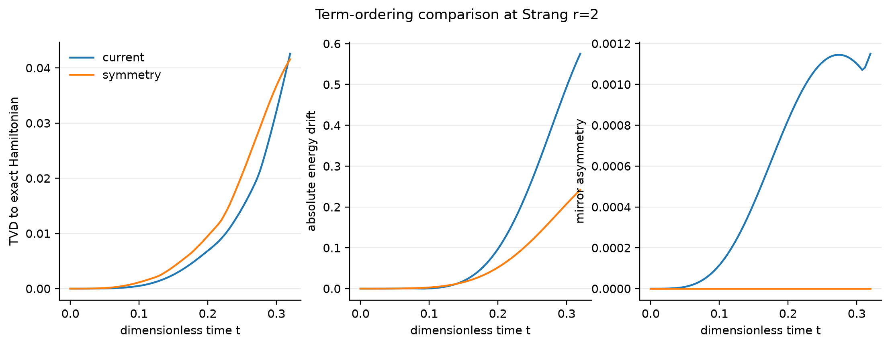

Current versus reflection-paired Strang ordering.

## Compiler experiment

- raw circuits: **35**;
- unique parameterized circuits: **35**;
- unique structural circuits: **30**;
- explicit angle-only duplicates: **5**;
- target configurations: **35** across **5** topology classes;
- primary compiler evaluations: **426**;
- three-seed sensitivity evaluations: **54**;
- verified primary evaluations: **426**.

The families cover N=2–6, r=1,2,4,8, current/reversed/reflection-paired ordering, and nonzero x/t variants. Targets are labeled synthetic line, ring, grid, heavy-hex-like, and sparse irregular graphs. Favorable, spread, and transpiler-selected placements are recorded. Strategies use the same ECR basis, target, layout constraint, optimization level, and seed within a case.

The primary objective is lexicographic: native 2Q count, then native 2Q depth, then estimated duration. Error-cost fields are stored separately and are not silently mixed into it.

| Strategy | Median native 2Q | Median native 2Q depth | Median routing ratio |
|---|---:|---:|---:|
| basic | 72.0 | 61.0 | 0.758 |
| basic_swaps | 72.0 | 61.0 | 0.766 |
| full_reduce | 98.0 | 89.0 | 1.522 |
| full_reduce_depth | 99.0 | 87.0 | 1.533 |
| qiskit | 80.0 | 72.0 | 0.809 |
| teleport | 68.0 | 60.0 | 0.691 |

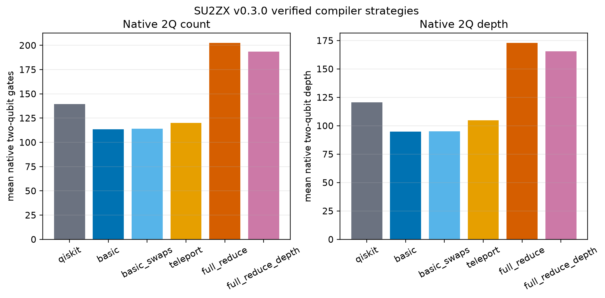

Native two-qubit count and depth by exact strategy.

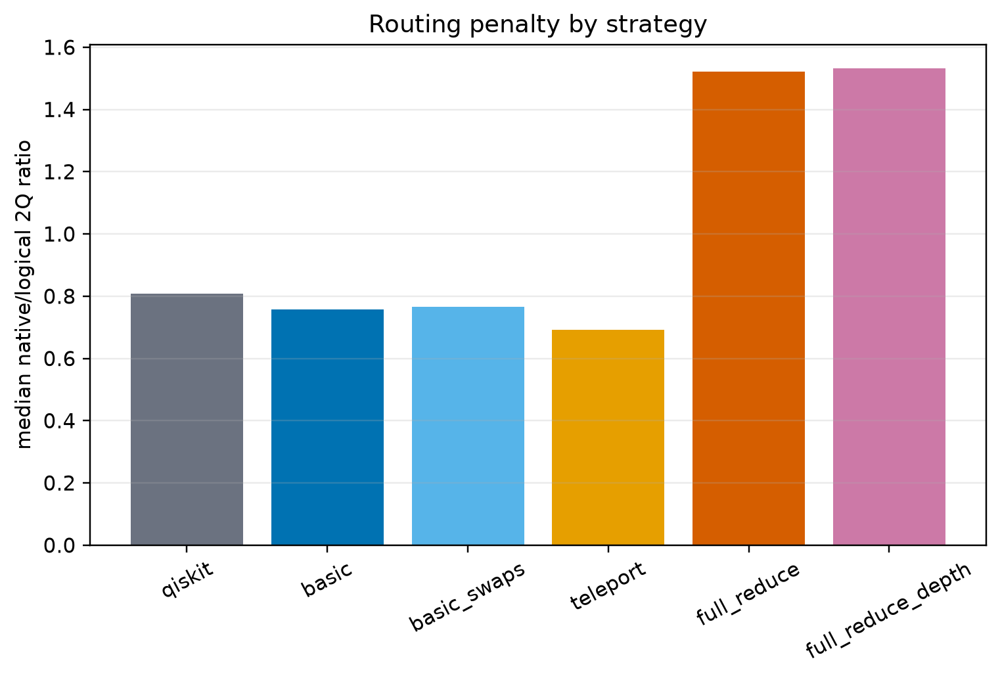

Native/logical two-qubit routing penalty by strategy.

## Winner distribution

After aggregating angle-only duplicates by structure/target, winners are `{"basic": 54, "teleport": 16}`. Strict native-2Q winners are `{"basic": 3, "teleport": 15}`. Basic and teleport each have at least three strict wins, the operational threshold used here to reject a single-anomaly interpretation. Qiskit tie-break wins in raw cases are not presented as strict native-2Q wins.

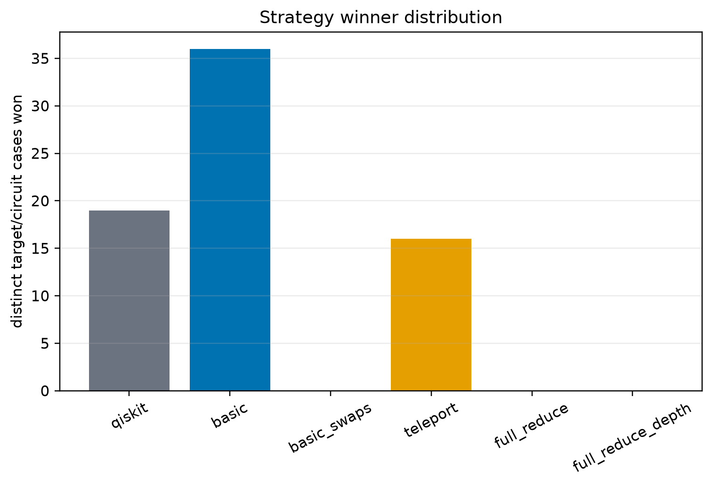

Lexicographic strategy winners.

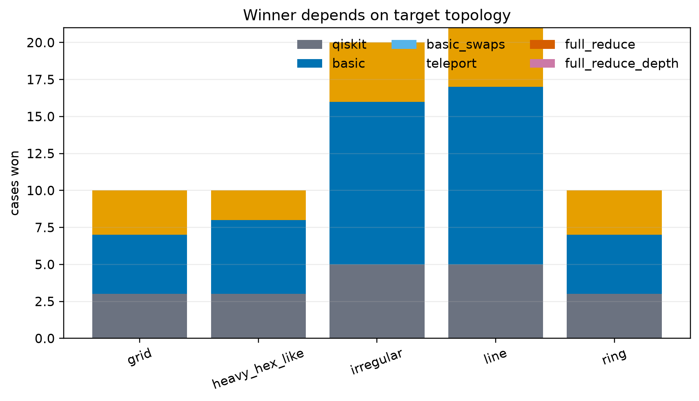

Winner distribution across synthetic topology classes.

## ML result: NULL

Features are available before compiler selection; no competing-strategy output is an input. Structural-family, leave-one-size-out, and leave-one-topology-out validation are stored in `selector_summary.json`. Primary top-1 accuracy is 0.324, median regret 0.0000, worst-case regret 0.5143, and oracle-equality fraction 0.704. The simple distance rule has regret 0.0666; the majority policy is always-basic with regret 0.0356. Oracle regret is zero.

The highest random-forest cost-model importances are source 2Q count, source gate count, and source depth. This does not establish causality; it indicates circuit scale dominated this bounded dataset more than topology summaries.

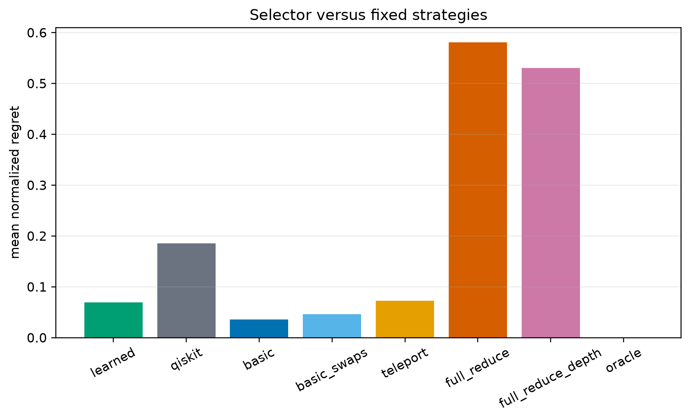

Grouped selector regret versus fixed and oracle policies.

## Tensor-network result: PASS

Qiskit Aer’s CPU MPS backend was validated at N=5,8 against the ideal Strang statevector. At bond dimension 32, maximum validated TVD is 9.599e-08, maximum energy error is 2.147e-09, and minimum fidelity is 1.000000000000. N=12 is exploratory without a dense exact-Hamiltonian reference.

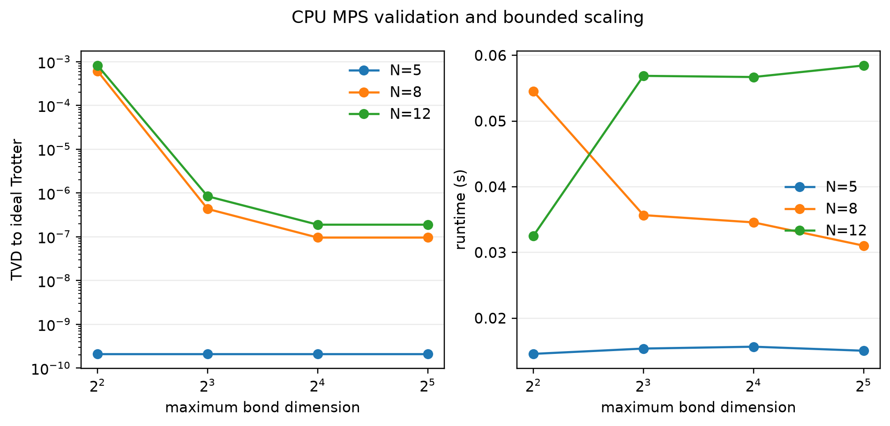

CPU MPS bond-dimension error and runtime.

## CUDA-Q and IBM status

CUDA-Q `qpp-cpu` is `LOCAL CPU PASS` using the shared conventions. CUDA-Q GPU and GPU tensor-network routes are `BLOCKED_BY_HARDWARE`; the local GTX 1060 Max-Q has compute capability 6.1. No driver, system, or global environment was modified.

IBM QPU is `NOT_RUN`. The guarded bundle requires `ALLOW_IBM_QPU_SUBMISSION=1`, `--submit`, and the exact fresh dry-run token; this run supplied none. The repository contains hardware-ready preparation but no QPU result and no paid job.

## Limitations

Targets are synthetic rather than calibration snapshots; the balanced-incomplete target design is not a full Cartesian grid; three strict Basic wins reject a single anomaly but remain a small minority; and the model does not beat always-Basic. Estimated durations/errors are target-model estimates, not measured hardware performance. N=12 MPS lacks dense exact-Hamiltonian comparison. GPU and real-QPU conclusions remain unavailable.

## Reproduction

```bash
bash scripts/bootstrap_env.sh
bash scripts/run_all.sh
```

Machine-readable data are under `artifacts/data/`, figures under `artifacts/figures/`, provenance under `artifacts/provenance/`, and validation logs under `artifacts/logs/`.

## Next research questions

1. Does strict winner diversity persist on named backend calibration snapshots and independent target seeds?
2. Can block-local or routing-aware ZX extraction create more strict wins without sacrificing exactness?
3. Which pre-compilation graph embeddings improve regret beyond always-Basic under topology holdout?
4. How does symmetry-aware ordering behave across sizes, times, and compiled hardware costs?
5. Can CPU MPS reach larger N using local-observable extraction without materializing a full statevector?
