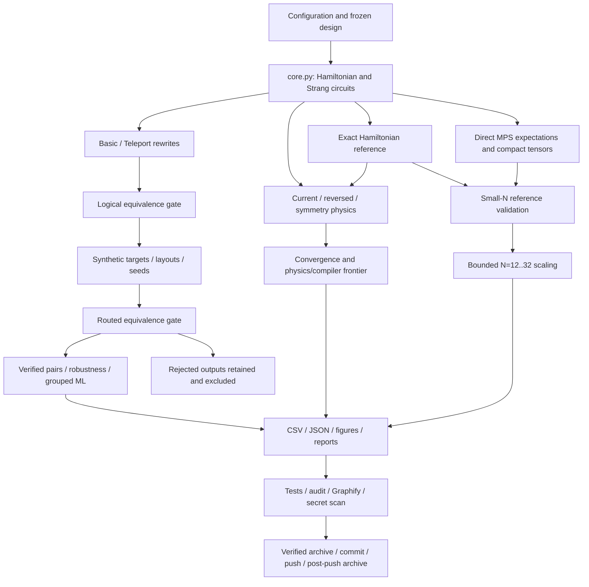

# Code logic, experiments, tests and validation

This report describes the implementation shipped in v0.4.0. Paths below are
relative to the repository/archive root. The companion function inventory is
generated from the actual Python AST. Full implementations are in src/, tools/,
tests/ and scripts/ in the same ZIP.

## End-to-end flow

## Hamiltonian and numerical references

`core.plaquette_chain_terms` defines every coefficient, including the identity
term. For N=1, H=1.5 I−1.5 Z−2x X. For N>1 it builds electric I/Z/ZZ terms and
boundary/bulk magnetic X, XZ and ZXZ terms. `hamiltonian` constructs SparsePauliOp;
`hamiltonian_components` separates electric and magnetic terms using the same
source. This is the severely truncated 2+1D plaquette-chain model, not a continuum
or physical-QCD calculation.

`pauli_word` writes q_(N−1)...q_0. `initial_state` uses little-endian integer
indices. `pauli_rotation` implements exp(−i theta P) using basis changes, a parity
ladder and Rz(2 theta), then uncomputes. `ordered_hamiltonian_terms` returns the
original order, its reversal, or commuting spatial-reflection orbits.
`strang_evolution` applies forward and backward half steps r times. It omits the
identity phase, so equivalence and state comparisons must allow global phase.

`exact_state` and `study.exact_states` provide exact small-system references.
`scaling_study.physics_run` uses sparse SciPy expm_multiply. `probabilities`,
`local_occupations`, `expectation` and `total_variation` compute observable metrics.
`measurement_family` and `reconstruct_energy` provide computational-basis plus
single-X-basis energy reconstruction. `project_to_probability_simplex` repairs
quasiprobabilities for downstream probability metrics; it is not proof of unbiased
mitigation.

## Compiler benchmark and robustness

`compiler_study.target_cases` builds five synthetic topology classes with
favorable, spread or transpiler-selected layouts. `compile_candidate` applies
Qiskit, Basic, Basic-with-swaps, Teleport, FullReduce or FullReduce-depth and
transpiles to the target. `core.optimize_with_pyzx` uses a temporary 2**40 QASM
fraction denominator cap and restores the PyZX setting. Logical equivalence is
checked at explicit atol=rtol=1e-10.

`robust_study.compiler_run` selects historical strict six-strategy winners and
tie/routing anchors, then adds the frozen r=3 prospective designs. Calibration
seed stays 7 while routing seeds are 11,19,29,37,47. Source and structural hashes
distinguish parameterized circuits from angle-normalized families.
`source_features`, `_interaction_features` and `_target_features` calculate
pre-selection features. Automatic-layout distances are identity-placement proxies.

`verify_native` embeds the zero input and three seeded random complex inputs into
the physical register, applies both layout permutations, evolves the routed
circuit, phase-aligns it with the ideal result and checks all amplitudes including
ancillas at 1e-10. It is a randomized isometry check, not exhaustive unitary proof.
The raw dataset retains failures. `pairwise` excludes the entire Basic/Teleport
pair if either member fails and checks shared source, target, seed and layout.

Count delta is Teleport−Basic; negative favors Teleport. Depth and duration deltas
are separate. A lexicographic label uses (count, depth, duration), while the ML
primary objective uses count. `robustness` reports fractions, entropy and
mean/median deltas: at least 80% strict wins and the matching median sign yields a
robust label; five count ties yield TIED; incomplete groups are INCONCLUSIVE.

The benchmark measures native 2Q count/depth, full depth, estimated synthetic
duration and compilation wall time. These are compiler measurements, not hardware
fidelity, QPU timings or evidence of quantum advantage. Thirty observed level-2
resynthesis errors near 7.18e-8 fail the gate and remain excluded.

## Pairwise prediction and leakage controls

`evaluate_ml` uses an explicit numeric feature list plus ordering, topology and
layout categories. Hashes are grouping keys, not inputs; compiled costs and
winner-derived features are forbidden. Logistic scaling is fit inside its training
pipeline. Models are logistic regression, depth-three tree, random forest
classifier and forest regression on the count delta. Regressor output below −0.5
selects Teleport, above 0.5 Basic, otherwise tie; executing a tie selects Basic.

Historical data supply structural GroupKFold and leave-one-size/topology/ordering
out folds. Prospective r=3 structural families remain separate. The model selected
by structural grouped regret is assessed against the existing prospective cohort.
Re-running this analysis is a reproducibility check, not another prospective test.
`frozen_choices` selects Teleport only for N<=3/current ordering; its configuration
SHA256 is checked against the pre-generation freeze.

`policy_metrics` reports accuracy, balanced accuracy, all-three-class confusion
matrix, mean/median/worst regret, oracle agreement and absolute 2Q penalty.
Regret=(chosen count−minimum count)/max(minimum count,1). Baselines are always Basic,
always Teleport, training-majority, frozen rule and oracle. The selected logistic
model has prospective regret 0.024954 versus 0.008966 for the strongest simple
policy: NULL. The tree's zero prospective regret is exploratory. Tree thresholds,
forest importances and logistic coefficients are saved for inspection.

## Symmetry, convergence and Pareto analysis

`symmetric_initial` occupies the center for odd N and two central sites for even N.
`physics_run` evaluates N=2..8, r=1,2,4,8 and (x,t)=(1,0.16),(2,0.32) in three
orders: 168 rows. Metrics include TVD, absolute energy drift, occupation reflection
asymmetry, survival error, maximum local occupation error, component energies and
norm error. Qiskit/Basic/Teleport compilation covers N=3,5,7 and r=1,2,4 at the
second parameter pair on one favorable synthetic line/seed: 81 routed-verified rows.

Log-log linear regression fits TVD against r. Exponent p is minus the slope; full
fits use r=1,2,4,8, asymptotic fits r=2,4,8. Standard error and R-squared are saved.
Representative current-order p values are 1.865777 and 1.978062. The frontier is
componentwise nondominance over TVD, mirror asymmetry, 2Q count/depth and duration
within each N/x/time group; mirror residuals below 1e-10 are tied. No weighted
scalar physics/hardware score is invented.

Symmetry reduces source depth in all 56 comparisons and energy drift in 44, but
TVD improves in 16 and worsens in 40: MIXED. Local occupation asymmetry is the grid
metric; the unit tests additionally check reflection of the full distribution.

## Tensor-network scaling and independent backend checks

`observable_operators` builds local Z/X, neighboring ZZ, component/total energy and
identity operators from core.py. `direct_mps` uses Aer save_expectation_value and
save_matrix_product_state, forbids statevector-save instructions, and returns
expectations plus compact tensor bytes, final maximum bond, runtime and process
RSS. Occupations follow (1−Z)/2. Identity expectation is normalized and does not
measure discarded weight; final tensor bytes are not peak simulation workspace.

`tn_run` validates N=5,8 against both ideal Trotter and exact Hamiltonian
references, then runs N=12,16,20,24,32 with caps 8/32/64 and thresholds
1e-10/1e-14/1e-14. It checks the cap-64 small-N error below 1e-7 before scaling.
Only small-N reference paths build statevectors. It stops on a 120-second case or
3000 MiB process high-water mark; Aer also has a 2048 MiB configured bound.
Long-time/high-entanglement behavior and exact large-N accuracy remain untested.
The older `tn_study.mps_state` deliberately saves a dense statevector and is only
the legacy cross-check, not the scaling implementation.

`tools/cudaq_reference.py` builds equivalent CUDA-Q evolution and Hamiltonian,
compares qpp-cpu with Qiskit probabilities and energy, and checks norm. N=1,2,5
artifacts pass 1e-8. Target-selectable GPU scripts exist, but the GTX 1060 Max-Q
cannot run the required GPU backend. `cutensornet_reference.py` and `tn_sweep.py`
are optional future-backend tools; their presence is not evidence of GPU execution.

## Hardware preparation and analysis

`qpu.build_isa_circuits` builds current/symmetry × Basic/Teleport, five times and
six bases: 120 circuits for comparison, or 60 in the legacy two-variant workflow.
It validates the compiled result and uses level 1. `validate_path` checks physical
connectivity. `qpu.main` defaults to dry run; live submission needs the environment
guard, --submit and an exact configuration-bound, one-use token younger than
15 minutes. Guard tests mock service and forbid Sampler submission.

`qpu_analysis.analyze` and `summarize` reconstruct occupations, survival, energy,
mirror asymmetry and TVD with raw/M3 results and paired intervals. The reference
hierarchy is exact Hamiltonian → ideal Trotter → compiled ideal → measured result.
Only synthetic preparation was executed; no real QPU result is in this release.

## What the automated tests actually establish

| Test file | Assertions and underlying functions |
|---|---|
| tests/test_core.py (12 tests) | Analytic N=1 matrix, spectrum, eigenvector and transition probability; N=2 matrix/ground energy; Hermiticity; exact/Trotter norms and endian mapping; Pauli rotation against matrix exponential; decreasing infidelity with r; exact mirror occupations; six-basis reconstructed energy; simplex normalization; PyZX strategies; structural hash angle normalization. Uses core Hamiltonian/evolution/measurement/hash functions. |
| tests/test_compiler.py (2) | Synthetic native compilation produces 2Q gates; target/layout classes are present. These are integration/scope checks, not claims of better cost. |
| tests/test_study.py (1) | generate_data produces expected rows/probabilities, finite numbers, initial energy and reconstructed-energy agreement. |
| tests/test_tn.py (1) | Legacy two-site MPS dense output agrees with circuit_state at 1e-10. |
| tests/test_qpu.py (1) | Synthetic dry-run path, 60 manifest entries, unique variant/time/basis triples and legacy confirmation-string format. No submission. |
| tests/test_v040.py (9 expanded cases) | Routed verification accepts correct layouts and rejects an injected X error; failed pair is excluded; direct MPS at N=5,8 matches ideal expectations <1e-7 while statevector save is forbidden; frozen-rule boundaries; odd/even reflection invariance <1e-12; PyZX precision/settings preservation; missing guard, wrong token and expired token cannot submit. |

Total: 26 executed pytest cases, zero failures. Exact test names, parameterization,
assert expressions and direct calls are in CODE_FUNCTION_INVENTORY.md; execution
timing and case-level results are in completion/pytest.xml. Forty-seven upstream
deprecation warnings remain visible. This is not exhaustive input or branch coverage.

## Research validation beyond pytest

`tools/validate_v040.controls` executes six strategies at N=2,3,5 with routed
verification, then recompiles one fixed case twice and compares circuit hashes.
`hardware` writes the synthetic QPY/JSON bundle. `audit` checks frozen design,
unique raw keys, fixed calibration hashes and five seeds, pair deltas and excluded
failures, historical hashes/row count, all saved split disjointness, TN status and
small-N tolerance, CUDA-Q errors and seed-reproduction receipt. These are saved-data
integrity checks; they do not rerun every historical compiler output.

The completion run freshly executes pytest, all static checks, saved-data audit,
pairwise reanalysis, the complete direct-MPS sweep, six-strategy controls and all
16 plots. The original 860-output routing study and 168/81 symmetry grid have
their original execution logs and are not mislabeled as freshly rerun. Baseline
and CUDA-Q original logs/results remain included.

`tools/plot_v040.save/main` generate PNG/PDF pairs and figure_sources.json linking
each plot to its CSV and caption. `tools/report_v040.main` renders the scientific
reports/provenance. `tools/refresh_graph_v040.main` merges grounded semantic
relationships and checks unique IDs, endpoints, no self-loops/duplicate pairs,
critical callable coverage and graph SHA256. Graph correctness checks structure;
they do not independently prove every semantic statement.

`tools/archive_v040.archive_files` selects code, tests, scripts, tools, configs,
docs, prompts, data, figures, provenance, logs and graph files. `scan` checks
sensitive filenames, token signatures, credential assignments and private keys.
The finalizer checks graph hash and validation receipts, writes a new timestamped
ZIP, tests CRCs, compares member names and every member SHA256 to disk, and writes
an external archive SHA256/integrity receipt. A signature scan cannot guarantee
detection of every possible secret format. Environments, caches, .git, .work,
credentials and prior ZIPs are excluded.

Reproduction commands are in README.md and scripts/run_v040.sh. Use repository-local
TMPDIR/cache settings and the existing .mamba/envs/su2zx interpreter. The final ZIP
also contains actual source, configuration, raw rejected records, split assignments,
model predictions, figure data, logs and provenance so these descriptions can be
checked against the implementation.
