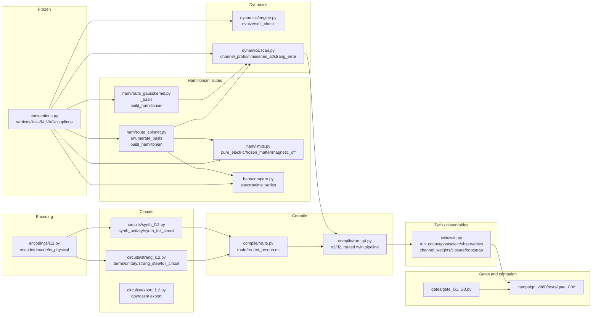

# SU2QC Logic and Tests

Documentation only. Every claim cites a source line or a test file. This describes
*code*, not results; it cites evidence files rather than reproducing numbers.

Package under description: `runs/section8_v0.5.0_20260907T0628Z/src/su2qc/`
(23 modules) with its tests under `runs/section8_v0.5.0_20260907T0628Z/tests/` and
gates under `runs/section8_v0.5.0_20260907T0628Z/gates/`, plus the campaign gate
tests under `runs/campaign_v060/tests/gate_C0/`.

## Pipeline

## Module narrative

### conventions.py
Single frozen source of vertices, links, parity, staggered phase, the staggered
vacuum `N_VAC=(0,2,0,2)`, the charge map, the Casimir, the coupling coefficients,
and the bit-order rule `q_(N-1)...q_0`. Imported by both Hamiltonian routes and
both circuit strata. See `SU2QC_CONTRACTS.md` entries and `conventions.py:1-100`.

### ham/route_spinnet.py
Spin-network route (route 1). `enumerate_basis` walks per-vertex gauge-invariant
options into 82 (jmax=0.5) or 152 (jmax=1.0) canonical labels; `build_hamiltonian`
assembles electric, mass, hopping, and plaquette terms into a csr_matrix.
Covered by `tests/test_route_spinnet.py` (dimensions, sector decomposition,
Hermiticity, `[H,N]=0`, pure-electric degeneracies, no-magnetic variant, the
dimension/hermiticity/commutator validators).

### ham/route_gausskernel.py
Gauss-kernel route (route 2), the redundant Kogut-Susskind space handled by an
explicit projection `P`. `build_hamiltonian` emits `(H, labels, P)`,
enumerating the physical basis by quotienting the full spin/occupation product.
`_select_convention` chooses the magnetic-plaquette convention that commutes with
the Gauss operators. Covered by `tests/test_route_gausskernel.py` (kernel
dimensions 82/152, projector orthonormality, Hermiticity, Gauss commutator norms,
pure-electric clusters, stretched label), and `tests/gate_C0/test_jmax1_counts.py`
(jmax=1 kernel dimension).

### ham/limits.py
Physical-limit checks: `pure_electric_check` (large-g2 degeneracies),
`frozen_matter_check` (m→large two-state block), `magnetic_off_check`
(cross-route/limit comparison). Imported by no supplied test — documented as
UNENFORCED in the contracts.

### ham/compare.py
Cross-route spectral and time-series comparison (`spectra_comparison`,
`time_series_comparison`). Not imported by any supplied test.

### encodings/l12.py
12-bit local encoding. Qubit `3v,3v+1,3v+2` = (first link, second link, matter)
per vertex; q0 least-significant. `encode`/`decode`/`physical_codes`/`is_physical`/
`leakage_flags`. Covered by `tests/test_l12.py` (82-code set, round-trip,
`encode(STRETCHED)==3793`, leakage flags exhaustive over 0..4095).

### circuits/strang_l12.py
Strang decomposition into the six term groups `D,h0..h3,B`; `unitary` builds each
block on its support, `strang_step`/`full_circuit` assemble the product formula,
`exact_strang_matrix` is the dense matrix reference. Covered by `tests/test_l12.py`
(block exactness/leak-freeness, Strang step vs exact product, merge equivalence,
leakage, Trotter scaling).

### circuits/synth_l12.py
Structured low-depth synthesis (`synth_unitary`, `synth_full_circuit`) and the
resource report `write_resources`. Covered by `tests/test_synth_l12.py`
(block exactness, synth Strang step, resource existence).

### compile/route.py
`fake_heron` backend, `route` (transpile + layout capture), `routed_resources`,
`routed_equivalence`/`state_equivalence` (fidelity-deficit scalar),
`pyzx_pass`. Executed only by `compile/run_g4.py`; no test imports it.

### compile/run_g4.py
Production routing script: `n2`/`d2` counting helpers plus the module-level
pipeline that builds, routes three pipelines, and runs the twin, writing
`compile/resources_routed.*`, `compile/layout.json`, and
`analysis/tables/twin_timeseries.csv`. No test imports it. Note every v0.5.0 twin
sigma it records is void as independent-repeat uncertainty (see contracts).

### twin/twin.py
The twin estimator: `twin_backend`, `add_measurements`, `run_counts`,
`postselect`, `observables`, `channel_weights`, `channel_closure_residual`,
`matched_subtraction`, `physical_yield`, `bootstrap`. The seed-defect and empty-input
contracts are documented in `SU2QC_CONTRACTS.md`. Covered by
`runs/campaign_v060/tests/gate_C0/test_estimator.py` (synthetic channels,
closure, matched subtraction, yield) and `test_twin_variance.py` (dict
distinctness — which does *not* establish independence).

### dynamics/engine.py
`evolve` (eigendecomposition-based exact evolution) and `self_check`
(dense-vs-Krylov deviation and drift checks). Covered by
`tests/test_dynamics.py`.

### dynamics/scan.py
Channel classification and probes: `channel_probs`, `mass_scan`,
`timeseries_at`, `truncation`, `strang_step_matrix`, `strang_error`,
`select_window`, `verify_window`. Covered by `tests/test_dynamics.py`
(channel masks partition the N=4 sector, window artifact checks, evolve/self-check
agreement).

### replicate.py
Deterministic hashing and manifest helpers (`sha256_file`, `manifest`,
`compare_manifests`, `write_manifest`). No test imports it.

## Gates

`gates/gate_G1.py`, `gate_G2.py`, `gate_G3.py` re-derive gate criteria and write
`gates/GATE_G*.json`. `gate_G3.py` runs the L12 suite and block-unitary checks and
evaluates Trotter scaling. The campaign gate tests live under
`runs/campaign_v060/tests/gate_C0/`; C0 is PARTIAL, C1 unamended, C2 NOT STARTED.

## Status integrity

This document changes no campaign status. No gate is asserted to pass here; the
gate/status vocabulary used elsewhere (`MEASURED / PROVEN / PROPOSED / NOT
IMPLEMENTED / UNENFORCED / DEFERRED / BLOCKED`) is preserved. All noisy simulator
numbers are EMULATED and every v0.5.0 twin sigma is void as independent-repeat
uncertainty.